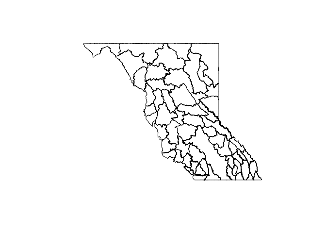
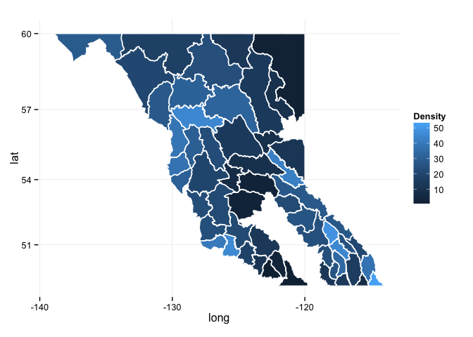

# Exploring Grizzly Data
  
June 5, 2015  

In this lesson, we are going to be using open data from [DataBC](http://data.gov.bc.ca) to learn about cleaning and tidying data, and merging tabular data with spatial data so we can visualize it.

We're going to use a number of packages in this lesson, so we will start with loading them all:


```r
library(tidyr)
library(dplyr)
library(knitr)
library(sp)
library(rgdal)
library(ggplot2)

options(knitr.table.format = "markdown")
```

### Grizzly bear data: population estimates and mortality history

DataBC has data on [population estimates](http://catalogue.data.gov.bc.ca/dataset/2012-grizzly-bear-population-estimates) and [mortality](http://catalogue.data.gov.bc.ca/dataset/history-of-grizzly-bear-mortalities). Let's download and explore both:


```r
## getting the data
mortality <- read.csv("http://www.env.gov.bc.ca/soe/archive/data/plants-and-animals/2012_Grizzly_Status/Grizzly_bear_mortality_history.csv", stringsAsFactors = FALSE)

population <- read.csv("http://www.env.gov.bc.ca/soe/archive/data/plants-and-animals/2012_Grizzly_Status/Grizzly_population_estimate_2012.csv", stringsAsFactors = FALSE)
```

Now that we have the data, let's have a look. The `head` function shows us the first six rows of data: 


```r
kable(head(mortality))
```


|     X| HUNT_YEAR|  MU| GBPU_ID|GBPU_NAME              |KILL_CODE   |SEX |AGE_CLASS |SPATIAL |X.1 |X.2 |X.3 |X.4                                                                                                                                                                                                                         |
|-----:|---------:|---:|-------:|:----------------------|:-----------|:---|:---------|:-------|:---|:---|:---|:---------------------------------------------------------------------------------------------------------------------------------------------------------------------------------------------------------------------------|
| 12038|      1976| 316|      40|Stein-Nahatlatch       |Hunter Kill |M   |'5-9      |no      |NA  |NA  |NA  |Notes                                                                                                                                                                                                                       |
| 12137|      1976| 332|      36|South Chilcotin Ranges |Hunter Kill |M   |'0-2      |no      |NA  |NA  |NA  |Prior to 2004, road and rail kills were not distinguished and were documented with 'Pick Ups'.                                                                                                                              |
| 12077|      1976| 332|      36|South Chilcotin Ranges |Hunter Kill |M   |NA        |no      |NA  |NA  |NA  |A Limited Entry Hunt (LEH) was instituted province-wide for grizzly bears in 1996.                                                                                                                                          |
| 12090|      1976| 402|      35|Flathead               |Hunter Kill |F   |'10-14    |no      |NA  |NA  |NA  |There was a province-wide moratorium on hunting grizzly bears in the spring of 2001.                                                                                                                                        |
| 12100|      1976| 402|      35|Flathead               |Hunter Kill |M   |'10-14    |no      |NA  |NA  |NA  |A limited number of records with a value of 'no' in the SPATIAL column have not been spatially verified and thus may be assigned to the incorrect Management Unit (MU); most of these assignment errors are from 1976-1980. |
| 12099|      1976| 402|      35|Flathead               |Hunter Kill |M   |'15+      |no      |NA  |NA  |NA  |                                                                                                                                                                                                                            |

We're going to use the [dplyr](https://github.com/hadley/dplyr) and [tidyr](https://github.com/hadley/tidyr) packages to organize and clean our data. First, we'll work on the mortality data:


```r
## let's get rid of unused columns
mortality <- mortality %>% 
  select(-contains("X."))

# Now we can separate the AGE_CLASS column into two columns specifying the 
# minumum age and the maximum age
clean_mort <- mortality %>%
  separate(AGE_CLASS, into = c("minimum_age", "maximum_age"), sep = "-", 
           extra = "merge") %>% 
  mutate(minimum_age = extract_numeric(minimum_age),
         maximum_age = extract_numeric(maximum_age))

kable(head(clean_mort))
```


|     X| HUNT_YEAR|  MU| GBPU_ID|GBPU_NAME              |KILL_CODE   |SEX | minimum_age| maximum_age|SPATIAL |
|-----:|---------:|---:|-------:|:----------------------|:-----------|:---|-----------:|-----------:|:-------|
| 12038|      1976| 316|      40|Stein-Nahatlatch       |Hunter Kill |M   |           5|           9|no      |
| 12137|      1976| 332|      36|South Chilcotin Ranges |Hunter Kill |M   |           0|           2|no      |
| 12077|      1976| 332|      36|South Chilcotin Ranges |Hunter Kill |M   |          NA|          NA|no      |
| 12090|      1976| 402|      35|Flathead               |Hunter Kill |F   |          10|          14|no      |
| 12100|      1976| 402|      35|Flathead               |Hunter Kill |M   |          10|          14|no      |
| 12099|      1976| 402|      35|Flathead               |Hunter Kill |M   |          15|          NA|no      |

Next let's tidy up the population data. The first, eighth, and ninth columns (`X.`) doesn't contain any useful information, so we can get rid if it:


```r
## We can do it directly on each column like so:
# population$X <- NULL
# population$X.1 <- NULL
# population$X.2 <- NULL

## Or we can use a loop to do it.  This would be effective if there 
## were a lot of columns we wanted to get rid of

for (n in names(population)) {
  if (grepl("X", n)) {
    population[n] <- NULL
  }
}
```

Now we see that there is some metadata in the first five rows of the `Notes.` column. We should remove it and store it in a variable:


```r
population_meta <- paste(population$Notes.[1:5], collapse = "; ")
population$Notes. <- NULL
```

We can store the metadata as a comment attribute of the population data frame:


```r
comment(population) <- population_meta
```

We can view the comment using similar syntax:


```r
comment(population)
```

```
## [1] "Please see the full report for more information and details on how these estimates were made: http://wwwd.env.gov.bc.ca/fw/wildlife/docs/Grizzly_Bear_Pop_Est_Report_Final_2012.pdf; GBPU = Grizzly bear population unit; MU = Management Unit; Total_Area is the amount of usable grizzly bear habitat (i.e., removed large rivers, lakes, glaciers etc.); Density is the estimated number of Grizzly bears/1000 sq km."
```

The population estimates are split up by Population Unit (`GBPU`) and Management Unit (`MU`). Let's summarise by Population Unit. `dplyr` has some great functions for this sort of exploratory analysis.


```r
## First we set the grouping variable to be GBPU
population_gbpu <- group_by(population, GBPU)

## Then we can summarize based on those groups. We will need to recalculate 
## the density.
population_gbpu <- summarise(population_gbpu, 
                             Estimate = sum(Estimate, na.rm = TRUE), 
                             Total_Area = sum(Total_Area, na.rm = TRUE), 
                             Density = Estimate / Total_Area * 1000)
head(population_gbpu)
```

```
## Source: local data frame [6 x 4]
## 
##                        GBPU Estimate Total_Area   Density
## 1                      Alta      132      13239  9.970542
## 2                    Babine      313      13805 22.672945
## 3 Blackwater-West Chilcotin       53      20416  2.596003
## 4             Bulkley-Lakes      439      22554 19.464397
## 5                   Cassiar      612      35803 17.093540
## 6          Central Monashee      147       6155 23.883022
```

### Grizzly Bear Population Units spatial data

First, you will need to get the data. Unfortunately, we are unable to read/download this directly from DataBC. Visit the [metadata record](http://catalogue.data.gov.bc.ca/dataset/grizzly-bear-population-units/resource/7a7713f9-bcbd-46b8-968a-03d343d367fb) for the data at DataBC. Click on the **Go To Resource** button and submit the form with the following settings:


When you get the email with the link to the zip file, save it in your working directory as `data/DataBC_GBPU.zip`

Next we'll unzip the file, and import the shapefile. You will need the `sp` and `rgdal` packages: 

- The `sp` package provides classes (data structures) for spatial objects, including `SpatialPoints`, 
`SpatialPolygons`, `SpatialLines`, etc. Each of these classes has a complementary class that can hold attributes that go along with the spatial data. They are `SpatialPointsDataFrame`, `SpatialPolygonsDataFrame`, `SpatialLinesDataFrame`. You always need this package when working with spatial data.

- The `rgdal` package provides input/output and projection/transformation operations for spatial data via bindings to the Geospatial Data Abstraction Library (GDAL).


```r
library(sp)
library(rgdal)
zipfile <- "data/DataBC_GBPU.zip"

if (!file.exists(zipfile)) {
  download.file("https://github.com/ateucher/BCenviroLessons/raw/master/data_exploration/data/DataBC_GBPU.zip", destfile = zipfile)
}

unzip(zipfile, exdir = "data")

gbpu <- readOGR(dsn = "data/GBPU_BC", layer = "GBPU_BC_polygon", 
                encoding = "ESRI Shapefile", stringsAsFactors = FALSE)
```

```
## OGR data source with driver: ESRI Shapefile 
## Source: "data/GBPU_BC", layer: "GBPU_BC_polygon"
## with 278 features
## It has 9 fields
```

```
## Warning in readOGR(dsn = "data/GBPU_BC", layer = "GBPU_BC_polygon",
## encoding = "ESRI Shapefile", : Z-dimension discarded
```

Let's explore the gbpu spatial object. It is of class `SpatialPolygonsDataFrame`, which is a special class of **R** object for representing spatial data, implemented in the `sp` package.


```r
class(gbpu)
```

```
## [1] "SpatialPolygonsDataFrame"
## attr(,"package")
## [1] "sp"
```

```r
summary(gbpu)
```

```
## Object of class SpatialPolygonsDataFrame
## Coordinates:
##          min        max
## x -138.87460 -112.37761
## y   46.95695   60.00142
## Is projected: FALSE 
## proj4string :
## [+proj=longlat +datum=NAD83 +no_defs +ellps=GRS80 +towgs84=0,0,0]
## Data attributes:
##     GBPU_TAG       GBPU_YRMOD   GBPU_VERS          GBPU_NAME        
##  Min.   : 0.00   Min.   : NA   Length:278         Length:278        
##  1st Qu.:23.00   1st Qu.: NA   Class :character   Class :character  
##  Median :42.50   Median : NA   Mode  :character   Mode  :character  
##  Mean   :42.68   Mean   :NaN                                        
##  3rd Qu.:64.00   3rd Qu.: NA                                        
##  Max.   :85.00   Max.   : NA                                        
##                  NA's   :278                                        
##     OBJECTID         GBPU_ID        GBPU_DISP          GBPUSTATUS       
##  Min.   :  1.00   Min.   : 841.0   Length:278         Length:278        
##  1st Qu.: 70.25   1st Qu.: 910.2   Class :character   Class :character  
##  Median :139.50   Median : 979.5   Mode  :character   Mode  :character  
##  Mean   :139.50   Mean   : 979.5                                        
##  3rd Qu.:208.75   3rd Qu.:1048.8                                        
##  Max.   :278.00   Max.   :1118.0                                        
##                                                                         
##   GPBU_W_BC        
##  Length:278        
##  Class :character  
##  Mode  :character  
##                    
##                    
##                    
## 
```

`sp` objects are S4 objects - which are kind of like regular S3 lists, but are more formally defined. They also have a special type of field, called slots, that are accessed using the `@` operator. You use this in the same way you use the `$` to access list elements, or columns in a data frame.

We can see the slotNames in an `sp` object using the `slotNames()` funcion, and look at any of them using `@`:


```r
slotNames(gbpu)
```

```
## [1] "data"        "polygons"    "plotOrder"   "bbox"        "proj4string"
```

```r
gbpu@data
```

```
##     GBPU_TAG GBPU_YRMOD GBPU_VERS                 GBPU_NAME OBJECTID
## 0         84         NA      2005              Tatshenshini        1
## 1         73         NA      2005                   Cassiar        2
## 2         51         NA      2005                     Taiga        3
## 3         52         NA      2005                    Hyland        4
## 4         55         NA      2005                    Muskwa        5
## 5         54         NA      2005                      Taku        6
## 6          1         NA      2005                     Rocky        7
## 7          2         NA      2005                      Alta        8
## 8         56         NA      2005                  Spatsizi        9
## 9         83         NA      2005      Edziza-Lower Stikine       10
## 10         3         NA      2005             Finlay-Ospika       11
## 11        59         NA      2005         Upper Skeena-Nass       12
## 12        47         NA      2005                      <NA>       13
## 13        62         NA      2005                   Stewart       14
## 14         5         NA      2005                   Omineca       15
## 15        63         NA      2005                 Cranberry       16
## 16        61         NA      2005                    Babine       17
## 17        82         NA      2005                   Moberly       18
## 18         7         NA      2005                   Parsnip       19
## 19        65         NA      2005             Bulkley-Lakes       20
## 20        66         NA      2005             Khutzeymateen       21
## 21        64         NA      2005                    Nation       22
## 22        70         NA      2005                  Francois       23
## 23         0         NA      2005                      <NA>       24
## 24        67         NA      2005               North Coast       25
## 25        10         NA      2005                    Robson       26
## 26        75         NA      2005                      <NA>       27
## 27        69         NA      2005                Tweedsmuir       28
## 28        15         NA      2005         Kitlope-Fiordland       29
## 29        11         NA      2005 Blackwater-West Chilcotin       30
## 30        48         NA      2005                      <NA>       31
## 31        12         NA      2005        Quesnel Lake North       32
## 32        16         NA      2005                Wells Gray       33
## 33        14         NA      2005          Columbia-Shuswap       34
## 34        76         NA      2005                      <NA>       35
## 35        17         NA      2005           Central Rockies       36
## 36        21         NA      2005       Klinaklini-Homathko       37
## 37        20         NA      2005            Kwatna-Owikeno       38
## 38        18         NA      2005             North Selkirk       39
## 39        36         NA      2005    South Chilcotin Ranges       40
## 40        77         NA      2005                      <NA>       41
## 41        23         NA      2005       Rockies Park Ranges       42
## 42        24         NA      2005             Spillamacheen       43
## 43        26         NA      2005             North Purcell       44
## 44        27         NA      2005          Kingcome-Wakeman       45
## 45        38         NA      2005          Central Monashee       46
## 46        28         NA      2005                      <NA>       47
## 47        37         NA      2005                 Toba-Bute       48
## 48        78         NA      2005                      <NA>       49
## 49        29         NA      2005             South Rockies       50
## 50        74         NA      2005           Central Selkirk       51
## 51        31         NA      2005           Central Purcell       52
## 52        40         NA      2005          Stein-Nahatlatch       53
## 53        33         NA      2005             South Purcell       54
## 54        39         NA      2005         Squamish-Lillooet       55
## 55        34         NA      2005                      <NA>       56
## 56        41         NA      2005                  Valhalla       57
## 57        42         NA      2005             Kettle-Granby       58
## 58        43         NA      2005            North Cascades       59
## 59        44         NA      2005            Garibaldi-Pitt       60
## 60        35         NA      2005                  Flathead       61
## 61        79         NA      2005                      <NA>       62
## 62        81         NA      2005                      <NA>       63
## 63        45         NA      2005                      Yahk       64
## 64        46         NA      2005             South Selkirk       65
## 65        53         NA      2005                      <NA>       66
## 66        80         NA      2005                      <NA>       67
## 67        32         NA      2005               Knight-Bute       68
## 68         6         NA      2005                      Hart       69
## 69        68         NA      2005                     Nulki       70
## 70        71         NA    2003 B              Tatshenshini       71
## 71        72         NA    2003 B                    Tagish       72
## 72        73         NA    2003 B                   Cassiar       73
## 73        51         NA    2003 B                     Taiga       74
## 74        52         NA    2003 B                    Hyland       75
## 75        55         NA    2003 B                    Muskwa       76
## 76        54         NA    2003 B                      Taku       77
## 77         1         NA    2003 B                     Rocky       78
## 78         2         NA    2003 B                      Alta       79
## 79        56         NA    2003 B                  Spatsizi       80
## 80        83         NA    2003 B      Edziza-Lower Stikine       81
## 81         3         NA    2003 B             Finlay-Ospika       82
## 82        59         NA    2003 B         Upper Skeena-Nass       83
## 83        47         NA    2003 B                      <NA>       84
## 84        62         NA    2003 B                   Stewart       85
## 85        63         NA    2003 B                 Cranberry       86
## 86        61         NA    2003 B                    Babine       87
## 87        82         NA    2003 B                   Moberly       88
## 88         7         NA    2003 B                   Parsnip       89
## 89        65         NA    2003 B             Bulkley-Lakes       90
## 90        66         NA    2003 B             Khutzeymateen       91
## 91        64         NA    2003 B                    Nation       92
## 92        70         NA    2003 B                  Francois       93
## 93         0         NA    2003 B                      <NA>       94
## 94        67         NA    2003 B               North Coast       95
## 95        68         NA    2003 B                     Nulki       96
## 96         8         NA    2003 B                    Bowron       97
## 97        10         NA    2003 B                    Robson       98
## 98        75         NA    2003 B                      <NA>       99
## 99        69         NA    2003 B                Tweedsmuir      100
## 100       15         NA    2003 B         Kitlope-Fiordland      101
## 101       11         NA    2003 B Blackwater-West Chilcotin      102
## 102       48         NA    2003 B                      <NA>      103
## 103       12         NA    2003 B        Quesnel Lake North      104
## 104       16         NA    2003 B                Wells Gray      105
## 105       14         NA    2003 B          Columbia-Shuswap      106
## 106       76         NA    2003 B                      <NA>      107
## 107       17         NA    2003 B           Central Rockies      108
## 108       21         NA    2003 B       Klinaklini-Homathko      109
## 109       20         NA    2003 B            Kwatna-Owikeno      110
## 110       18         NA    2003 B             North Selkirk      111
## 111       36         NA    2003 B    South Chilcotin Ranges      112
## 112       77         NA    2003 B                      <NA>      113
## 113       23         NA    2003 B       Rockies Park Ranges      114
## 114       24         NA    2003 B             Spillamacheen      115
## 115       26         NA    2003 B             North Purcell      116
## 116       27         NA    2003 B          Kingcome-Wakeman      117
## 117       38         NA    2003 B          Central Monashee      118
## 118       28         NA    2003 B                      <NA>      119
## 119       37         NA    2003 B                 Toba-Bute      120
## 120       78         NA    2003 B                      <NA>      121
## 121       29         NA    2003 B             South Rockies      122
## 122       32         NA    2003 B               Knight-Bute      123
## 123       74         NA    2003 B           Central Selkirk      124
## 124       31         NA    2003 B           Central Purcell      125
## 125       40         NA    2003 B          Stein-Nahatlatch      126
## 126       33         NA    2003 B             South Purcell      127
## 127       39         NA    2003 B         Squamish-Lillooet      128
## 128       34         NA    2003 B                      <NA>      129
## 129       41         NA    2003 B                  Valhalla      130
## 130       42         NA    2003 B             Kettle-Granby      131
## 131       43         NA    2003 B            North Cascades      132
## 132       44         NA    2003 B            Garibaldi-Pitt      133
## 133       35         NA    2003 B                  Flathead      134
## 134       79         NA    2003 B                      <NA>      135
## 135       81         NA    2003 B                      <NA>      136
## 136       45         NA    2003 B                      Yahk      137
## 137       46         NA    2003 B             South Selkirk      138
## 138       53         NA    2003 B                      <NA>      139
## 139       80         NA    2003 B                      <NA>      140
## 140        5         NA    2003 B                   Omineca      141
## 141        6         NA    2003 B                      Hart      142
## 142       71         NA    2003 A              Tatshenshini      143
## 143       72         NA    2003 A                    Tagish      144
## 144       73         NA    2003 A                   Cassiar      145
## 145       51         NA    2003 A                     Taiga      146
## 146       55         NA    2003 A                    Muskwa      147
## 147       52         NA    2003 A                    Hyland      148
## 148       54         NA    2003 A                      Taku      149
## 149        1         NA    2003 A                     Rocky      150
## 150        2         NA    2003 A                      Alta      151
## 151       56         NA    2003 A                  Spatsizi      152
## 152       58         NA    2003 A                    Edziza      153
## 153        3         NA    2003 A             Finlay-Ospika      154
## 154       60         NA    2003 A             Lower Stikine      155
## 155       59         NA    2003 A         Upper Skeena-Nass      156
## 156        5         NA    2003 A                   Omineca      157
## 157       62         NA    2003 A                   Stewart      158
## 158       63         NA    2003 A                 Cranberry      159
## 159       82         NA    2003 A                   Moberly      160
## 160       61         NA    2003 A                    Babine      161
## 161        6         NA    2003 A                      Hart      162
## 162        7         NA    2003 A                   Parsnip      163
## 163       65         NA    2003 A             Bulkley-Lakes      164
## 164       66         NA    2003 A             Khutzeymateen      165
## 165       64         NA    2003 A                    Nation      166
## 166       70         NA    2003 A                  Francois      167
## 167        0         NA    2003 A                      <NA>      168
## 168       67         NA    2003 A               North Coast      169
## 169       68         NA    2003 A                     Nulki      170
## 170        8         NA    2003 A                    Bowron      171
## 171       10         NA    2003 A                    Robson      172
## 172       75         NA    2003 A                      <NA>      173
## 173       69         NA    2003 A                Tweedsmuir      174
## 174       15         NA    2003 A         Kitlope-Fiordland      175
## 175       11         NA    2003 A Blackwater-West Chilcotin      176
## 176       12         NA    2003 A        Quesnel Lake North      177
## 177       16         NA    2003 A                Wells Gray      178
## 178       14         NA    2003 A          Columbia-Shuswap      179
## 179       76         NA    2003 A                      <NA>      180
## 180       17         NA    2003 A           Central Rockies      181
## 181       21         NA    2003 A       Klinaklini-Homathko      182
## 182       20         NA    2003 A            Kwatna-Owikeno      183
## 183       18         NA    2003 A             North Selkirk      184
## 184       77         NA    2003 A                      <NA>      185
## 185       23         NA    2003 A       Rockies Park Ranges      186
## 186       24         NA    2003 A             Spillamacheen      187
## 187       26         NA    2003 A             North Purcell      188
## 188       27         NA    2003 A          Kingcome-Wakeman      189
## 189       28         NA    2003 A                      <NA>      190
## 190       78         NA    2003 A                      <NA>      191
## 191       29         NA    2003 A             South Rockies      192
## 192       74         NA    2003 A           Central Selkirk      193
## 193       32         NA    2003 A               Knight-Bute      194
## 194       31         NA    2003 A           Central Purcell      195
## 195       33         NA    2003 A             South Purcell      196
## 196       34         NA    2003 A                      <NA>      197
## 197       35         NA    2003 A                  Flathead      198
## 198       79         NA    2003 A                      <NA>      199
## 199       80         NA    2003 A                      <NA>      200
## 200       47         NA    2003 A                      <NA>      201
## 201       48         NA    2003 A                      <NA>      202
## 202       49         NA    2003 A Blackwater-West Chilcotin      203
## 203       81         NA    2003 A                      <NA>      204
## 204       53         NA    2003 A                      <NA>      205
## 205       36         NA    2003 A    South Chilcotin Ranges      206
## 206       37         NA    2003 A                 Toba-Bute      207
## 207       40         NA    2003 A          Stein-Nahatlatch      208
## 208       39         NA    2003 A         Squamish-Lillooet      209
## 209       42         NA    2003 A             Kettle-Granby      210
## 210       43         NA    2003 A            North Cascades      211
## 211       44         NA    2003 A            Garibaldi-Pitt      212
## 212       45         NA    2003 A                      Yahk      213
## 213       46         NA    2003 A             South Selkirk      214
## 214       38         NA    2003 A          Central Monashee      215
## 215       41         NA    2003 A                  Valhalla      216
## 216       84         NA      2012              Tatshenshini      217
## 217       73         NA      2012                   Cassiar      218
## 218       51         NA      2012                     Taiga      219
## 219       52         NA      2012                    Hyland      220
## 220       55         NA      2012                    Muskwa      221
## 221       54         NA      2012                      Taku      222
## 222        1         NA      2012                     Rocky      223
## 223        2         NA      2012                      Alta      224
## 224       56         NA      2012                  Spatsizi      225
## 225       83         NA      2012      Edziza-Lower Stikine      226
## 226        3         NA      2012             Finlay-Ospika      227
## 227       59         NA      2012         Upper Skeena-Nass      228
## 228       47         NA      2012                      <NA>      229
## 229       62         NA      2012                   Stewart      230
## 230        5         NA      2012                   Omineca      231
## 231       63         NA      2012                 Cranberry      232
## 232       61         NA      2012                    Babine      233
## 233       82         NA      2012                   Moberly      234
## 234        7         NA      2012                   Parsnip      235
## 235       65         NA      2012             Bulkley-Lakes      236
## 236       66         NA      2012             Khutzeymateen      237
## 237       64         NA      2012                    Nation      238
## 238       70         NA      2012                  Francois      239
## 239       67         NA      2012               North Coast      240
## 240       10         NA      2012                    Robson      241
## 241       69         NA      2012                Tweedsmuir      242
## 242       15         NA      2012         Kitlope-Fiordland      243
## 243       11         NA      2012 Blackwater-West Chilcotin      244
## 244       48         NA      2012                      <NA>      245
## 245       12         NA      2012        Quesnel Lake North      246
## 246       16         NA      2012                Wells Gray      247
## 247       14         NA      2012          Columbia-Shuswap      248
## 248       17         NA      2012           Central Rockies      249
## 249       21         NA      2012       Klinaklini-Homathko      250
## 250       20         NA      2012            Kwatna-Owikeno      251
## 251       18         NA      2012             North Selkirk      252
## 252       36         NA      2012    South Chilcotin Ranges      253
## 253       23         NA      2012       Rockies Park Ranges      254
## 254       24         NA      2012             Spillamacheen      255
## 255       26         NA      2012            North Purcells      256
## 256       27         NA      2012          Kingcome-Wakeman      257
## 257       38         NA      2012          Central Monashee      258
## 258       28         NA      2012                      <NA>      259
## 259       37         NA      2012                 Toba-Bute      260
## 260       29         NA      2012             South Rockies      261
## 261       74         NA      2012           Central Selkirk      262
## 262       40         NA      2012          Stein-Nahatlatch      263
## 263       39         NA      2012         Squamish-Lillooet      264
## 264       34         NA      2012                      <NA>      265
## 265       41         NA      2012                  Valhalla      266
## 266       42         NA      2012             Kettle-Granby      267
## 267       43         NA      2012            North Cascades      268
## 268       44         NA      2012            Garibaldi-Pitt      269
## 269       35         NA      2012                  Flathead      270
## 270       81         NA      2012                      <NA>      271
## 271       45         NA      2012                      Yahk      272
## 272       46         NA      2012             South Selkirk      273
## 273       53         NA      2012                      <NA>      274
## 274       32         NA      2012               Knight-Bute      275
## 275        6         NA      2012                      Hart      276
## 276       68         NA      2012                     Nulki      277
## 277       85         NA      2012    Central-South Purcells      278
##     GBPU_ID                   GBPU_DISP GBPUSTATUS GPBU_W_BC
## 0       841                Tatshenshini     Viable         Y
## 1       842                     Cassiar     Viable         Y
## 2       843                       Taiga     Viable         Y
## 3       844                      Hyland     Viable         Y
## 4       845                      Muskwa     Viable         Y
## 5       846                        Taku     Viable         Y
## 6       847                       Rocky     Viable         Y
## 7       848                        Alta     Viable         Y
## 8       849                    Spatsizi     Viable         Y
## 9       850        Edziza-Lower Stikine     Viable         Y
## 10      851             Finlay-\\Ospika     Viable         Y
## 11      852       Upper \\Skeena-\\Nass     Viable         Y
## 12      853                        <NA> Extirpated         Y
## 13      854                     Stewart     Viable         Y
## 14      855                     Omineca     Viable         Y
## 15      856                   Cranberry     Viable         Y
## 16      857                      Babine     Viable         Y
## 17      858                     Moberly     Viable         Y
## 18      859                     Parsnip     Viable         Y
## 19      860             Bulkley-\\Lakes     Viable         Y
## 20      861               Khutzeymateen     Viable         Y
## 21      862                      Nation     Viable         Y
## 22      863                    Francois     Viable         Y
## 23      864                        <NA>     Viable         N
## 24      865               North \\Coast     Viable         Y
## 25      866                      Robson     Viable         Y
## 26      867                        <NA>     Viable         N
## 27      868                  Tweedsmuir     Viable         Y
## 28      869         Kitlope-\\Fiordland     Viable         Y
## 29      870 Blackwater-\\West Chilcotin Threatened         Y
## 30      871                        <NA> Extirpated         Y
## 31      872      Quesnel \\Lake \\North     Viable         Y
## 32      873                Wells \\Gray     Viable         Y
## 33      874          Columbia-\\Shuswap     Viable         Y
## 34      875                        <NA>     Viable         N
## 35      876           Central \\Rockies     Viable         Y
## 36      877       Klinaklini-\\Homathko     Viable         Y
## 37      878            Kwatna-\\Owikeno     Viable         Y
## 38      879             North \\Selkirk     Viable         Y
## 39      880  South \\Chilcotin \\Ranges Threatened         Y
## 40      881                        <NA>     Viable         N
## 41      882     Rockies \\Park \\Ranges     Viable         Y
## 42      883               Spillamacheen     Viable         Y
## 43      884             North \\Purcell     Viable         Y
## 44      885          Kingcome-\\Wakeman     Viable         Y
## 45      886          Central \\Monashee     Viable         Y
## 46      887                        <NA>     Viable         Y
## 47      888                 Toba-\\Bute     Viable         Y
## 48      889                        <NA>     Viable         N
## 49      890             South \\Rockies     Viable         Y
## 50      891           Central \\Selkirk     Viable         Y
## 51      892           Central \\Purcell     Viable         Y
## 52      893          Stein-\\Nahatlatch Threatened         Y
## 53      894             South \\Purcell     Viable         Y
## 54      895         Squamish-\\Lillooet Threatened         Y
## 55      896                        <NA>     Viable         Y
## 56      897                    Valhalla     Viable         Y
## 57      898             Kettle-\\Granby Threatened         Y
## 58      899            North \\Cascades Threatened         Y
## 59      900            Garibaldi-\\Pitt Threatened         Y
## 60      901                    Flathead     Viable         Y
## 61      902                        <NA>     Viable         N
## 62      903                        <NA> Extirpated         Y
## 63      904                        Yahk Threatened         Y
## 64      905             South \\Selkirk Threatened         Y
## 65      906                        <NA> Extirpated         Y
## 66      907                        <NA>     Viable         N
## 67      908               Knight-\\Bute     Viable         Y
## 68      909                        Hart     Viable         Y
## 69      910                       Nulki     Viable         Y
## 70      911                Tatshenshini     Viable         Y
## 71      912                      Tagish     Viable         Y
## 72      913                     Cassiar     Viable         Y
## 73      914                       Taiga     Viable         Y
## 74      915                      Hyland     Viable         Y
## 75      916                      Muskwa     Viable         Y
## 76      917                        Taku     Viable         Y
## 77      918                       Rocky     Viable         Y
## 78      919                        Alta     Viable         Y
## 79      920                    Spatsizi     Viable         Y
## 80      921        Edziza-Lower Stikine     Viable         Y
## 81      922             Finlay-\\Ospika     Viable         Y
## 82      923       Upper \\Skeena-\\Nass     Viable         Y
## 83      924                        <NA> Extirpated         Y
## 84      925                     Stewart     Viable         Y
## 85      926                   Cranberry     Viable         Y
## 86      927                      Babine     Viable         Y
## 87      928                     Moberly     Viable         Y
## 88      929                     Parsnip     Viable         Y
## 89      930             Bulkley-\\Lakes     Viable         Y
## 90      931               Khutzeymateen     Viable         Y
## 91      932                      Nation     Viable         Y
## 92      933                    Francois     Viable         Y
## 93      934                        <NA>     Viable         N
## 94      935               North \\Coast     Viable         Y
## 95      936                       Nulki     Viable         Y
## 96      937                      Bowron     Viable         Y
## 97      938                      Robson     Viable         Y
## 98      939                        <NA>     Viable         N
## 99      940                  Tweedsmuir     Viable         Y
## 100     941         Kitlope-\\Fiordland     Viable         Y
## 101     942 Blackwater-\\West Chilcotin     Viable         Y
## 102     943                        <NA> Extirpated         Y
## 103     944      Quesnel \\Lake \\North     Viable         Y
## 104     945                Wells \\Gray     Viable         Y
## 105     946          Columbia-\\Shuswap     Viable         Y
## 106     947                        <NA>     Viable         N
## 107     948           Central \\Rockies     Viable         Y
## 108     949       Klinaklini-\\Homathko     Viable         Y
## 109     950            Kwatna-\\Owikeno     Viable         Y
## 110     951             North \\Selkirk     Viable         Y
## 111     952  South \\Chilcotin \\Ranges Threatened         Y
## 112     953                        <NA>     Viable         N
## 113     954     Rockies \\Park \\Ranges     Viable         Y
## 114     955               Spillamacheen     Viable         Y
## 115     956             North \\Purcell     Viable         Y
## 116     957          Kingcome-\\Wakeman     Viable         Y
## 117     958          Central \\Monashee Threatened         Y
## 118     959                        <NA>     Viable         Y
## 119     960                 Toba-\\Bute Threatened         Y
## 120     961                        <NA>     Viable         N
## 121     962             South \\Rockies     Viable         Y
## 122     963               Knight-\\Bute     Viable         Y
## 123     964           Central \\Selkirk     Viable         Y
## 124     965           Central \\Purcell     Viable         Y
## 125     966          Stein-\\Nahatlatch Threatened         Y
## 126     967             South \\Purcell     Viable         Y
## 127     968         Squamish-\\Lillooet Threatened         Y
## 128     969                        <NA>     Viable         Y
## 129     970                    Valhalla Threatened         Y
## 130     971             Kettle-\\Granby Threatened         Y
## 131     972            North \\Cascades Threatened         Y
## 132     973            Garibaldi-\\Pitt Threatened         Y
## 133     974                    Flathead     Viable         Y
## 134     975                        <NA>     Viable         N
## 135     976                        <NA> Extirpated         Y
## 136     977                        Yahk Threatened         Y
## 137     978             South \\Selkirk Threatened         Y
## 138     979                        <NA> Extirpated         Y
## 139     980                        <NA>     Viable         N
## 140     981                     Omineca     Viable         Y
## 141     982                        Hart     Viable         Y
## 142     983                Tatshenshini     Viable         Y
## 143     984                      Tagish     Viable         Y
## 144     985                     Cassiar     Viable         Y
## 145     986                       Taiga     Viable         Y
## 146     987                      Muskwa     Viable         Y
## 147     988                      Hyland     Viable         Y
## 148     989                        Taku     Viable         Y
## 149     990                       Rocky     Viable         Y
## 150     991                        Alta     Viable         Y
## 151     992                    Spatsizi     Viable         Y
## 152     993                      Edziza     Viable         Y
## 153     994             Finlay-\\Ospika     Viable         Y
## 154     995             Lower \\Stikine     Viable         Y
## 155     996       Upper \\Skeena-\\Nass     Viable         Y
## 156     997                     Omineca     Viable         Y
## 157     998                     Stewart     Viable         Y
## 158     999                   Cranberry     Viable         Y
## 159    1000                     Moberly     Viable         Y
## 160    1001                      Babine     Viable         Y
## 161    1002                        Hart     Viable         Y
## 162    1003                     Parsnip     Viable         Y
## 163    1004             Bulkley-\\Lakes     Viable         Y
## 164    1005               Khutzeymateen     Viable         Y
## 165    1006                      Nation     Viable         Y
## 166    1007                    Francois     Viable         Y
## 167    1008                        <NA>     Viable         N
## 168    1009               North \\Coast     Viable         Y
## 169    1010                       Nulki     Viable         Y
## 170    1011                      Bowron     Viable         Y
## 171    1012                      Robson     Viable         Y
## 172    1013                        <NA>     Viable         N
## 173    1014                  Tweedsmuir     Viable         Y
## 174    1015         Kitlope-\\Fiordland     Viable         Y
## 175    1016 Blackwater-\\West Chilcotin     Viable         Y
## 176    1017      Quesnel \\Lake \\North     Viable         Y
## 177    1018                Wells \\Gray     Viable         Y
## 178    1019          Columbia-\\Shuswap     Viable         Y
## 179    1020                        <NA>     Viable         N
## 180    1021           Central \\Rockies     Viable         Y
## 181    1022       Klinaklini-\\Homathko     Viable         Y
## 182    1023            Kwatna-\\Owikeno     Viable         Y
## 183    1024             North \\Selkirk     Viable         Y
## 184    1025                        <NA>     Viable         N
## 185    1026     Rockies \\Park \\Ranges     Viable         Y
## 186    1027               Spillamacheen     Viable         Y
## 187    1028             North \\Purcell     Viable         Y
## 188    1029          Kingcome-\\Wakeman     Viable         Y
## 189    1030                        <NA>     Viable         Y
## 190    1031                        <NA>     Viable         N
## 191    1032             South \\Rockies     Viable         Y
## 192    1033           Central \\Selkirk     Viable         Y
## 193    1034               Knight-\\Bute     Viable         Y
## 194    1035           Central \\Purcell     Viable         Y
## 195    1036             South \\Purcell     Viable         Y
## 196    1037                        <NA>     Viable         Y
## 197    1038                    Flathead     Viable         Y
## 198    1039                        <NA>     Viable         N
## 199    1040                        <NA>     Viable         N
## 200    1041                        <NA> Extirpated         Y
## 201    1042                        <NA> Extirpated         Y
## 202    1043                        <NA> Extirpated         Y
## 203    1044                        <NA> Extirpated         Y
## 204    1045                        <NA> Extirpated         Y
## 205    1046  South \\Chilcotin \\Ranges Threatened         Y
## 206    1047                 Toba-\\Bute Threatened         Y
## 207    1048          Stein-\\Nahatlatch Threatened         Y
## 208    1049         Squamish-\\Lillooet Threatened         Y
## 209    1050             Kettle-\\Granby Threatened         Y
## 210    1051            North \\Cascades Threatened         Y
## 211    1052            Garibaldi-\\Pitt Threatened         Y
## 212    1053                        Yahk Threatened         Y
## 213    1054             South \\Selkirk Threatened         Y
## 214    1055          Central \\Monashee Threatened         Y
## 215    1056                    Valhalla Threatened         Y
## 216    1057                Tatshenshini     Viable         Y
## 217    1058                     Cassiar     Viable         Y
## 218    1059                       Taiga     Viable         Y
## 219    1060                      Hyland     Viable         Y
## 220    1061                      Muskwa     Viable         Y
## 221    1062                        Taku     Viable         Y
## 222    1063                       Rocky     Viable         Y
## 223    1064                        Alta     Viable         Y
## 224    1065                    Spatsizi     Viable         Y
## 225    1066        Edziza-Lower Stikine     Viable         Y
## 226    1067             Finlay-\\Ospika     Viable         Y
## 227    1068       Upper \\Skeena-\\Nass     Viable         Y
## 228    1069                        <NA> Extirpated         Y
## 229    1070                     Stewart     Viable         Y
## 230    1071                     Omineca     Viable         Y
## 231    1072                   Cranberry     Viable         Y
## 232    1073                      Babine     Viable         Y
## 233    1074                     Moberly     Viable         Y
## 234    1075                     Parsnip     Viable         Y
## 235    1076             Bulkley-\\Lakes     Viable         Y
## 236    1077               Khutzeymateen     Viable         Y
## 237    1078                      Nation     Viable         Y
## 238    1079                    Francois     Viable         Y
## 239    1080               North \\Coast     Viable         Y
## 240    1081                      Robson     Viable         Y
## 241    1082                  Tweedsmuir     Viable         Y
## 242    1083         Kitlope-\\Fiordland     Viable         Y
## 243    1084 Blackwater-\\West Chilcotin Threatened         Y
## 244    1085                        <NA> Extirpated         Y
## 245    1086      Quesnel \\Lake \\North     Viable         Y
## 246    1087                Wells \\Gray     Viable         Y
## 247    1088          Columbia-\\Shuswap     Viable         Y
## 248    1089           Central \\Rockies     Viable         Y
## 249    1090       Klinaklini-\\Homathko     Viable         Y
## 250    1091            Kwatna-\\Owikeno     Viable         Y
## 251    1092             North \\Selkirk     Viable         Y
## 252    1093  South \\Chilcotin \\Ranges Threatened         Y
## 253    1094     Rockies \\Park \\Ranges     Viable         Y
## 254    1095               Spillamacheen     Viable         Y
## 255    1096            North \\Purcells     Viable         Y
## 256    1097          Kingcome-\\Wakeman     Viable         Y
## 257    1098          Central \\Monashee     Viable         Y
## 258    1099                        <NA>     Viable         Y
## 259    1100                 Toba-\\Bute     Viable         Y
## 260    1101             South \\Rockies     Viable         Y
## 261    1102           Central \\Selkirk     Viable         Y
## 262    1103          Stein-\\Nahatlatch Threatened         Y
## 263    1104         Squamish-\\Lillooet Threatened         Y
## 264    1105                        <NA>     Viable         Y
## 265    1106                    Valhalla     Viable         Y
## 266    1107             Kettle-\\Granby Threatened         Y
## 267    1108            North \\Cascades Threatened         Y
## 268    1109            Garibaldi-\\Pitt Threatened         Y
## 269    1110                    Flathead     Viable         Y
## 270    1111                        <NA> Extirpated         Y
## 271    1112                        Yahk Threatened         Y
## 272    1113             South \\Selkirk Threatened         Y
## 273    1114                        <NA> Extirpated         Y
## 274    1115               Knight-\\Bute     Viable         Y
## 275    1116                        Hart     Viable         Y
## 276    1117                       Nulki     Viable         Y
## 277    1118      Central-South Purcells     Viable         Y
```


From the [metadata page](http://catalogue.data.gov.bc.ca/dataset/grizzly-bear-population-units/resource/7a7713f9-bcbd-46b8-968a-03d343d367fb), we know that there are several versions of the population units in this file. From the summary above it looks like the version is stored in the `GBPU_VERS`. Let's only use the latest version (2012). Note that we can use subsetting using `$` and `[` just like we do on normal data frames.

We can then plot the polygons to have a quick look.


```r
gbpu_2012 <- gbpu[gbpu$GBPU_VERS == 2012, ]
plot(gbpu_2012)
```

 

Now that we have a map of GBPUs, and a data frame with a single population estimate per GBPU, we can merge the population estimates into the SpatialPolygonsDataFrame.


```r
## First we should make sure that the GBPU names in the two objects are the same
setdiff(na.omit(gbpu_2012$GBPU_NAME), population_gbpu$GBPU)
```

```
## [1] "North Purcells"         "Central-South Purcells"
```

```r
setdiff(population_gbpu$GBPU, na.omit(gbpu_2012$GBPU_NAME))
```

```
## [1] "Central Purcells" "North Purcell"
```

```r
population_gbpu$GBPU[population_gbpu$GBPU == "Central Purcells"] <- "Central-South Purcells"
population_gbpu$GBPU[population_gbpu$GBPU == "North Purcell"] <- "North Purcells"

## Check to make sure they are equal now
all.equal(sort(population_gbpu$GBPU), sort(na.omit(gbpu_2012$GBPU_NAME)))
```

```
## [1] TRUE
```

Now lets plot the map using ggplot2, and fill the polygons based on population density. First we need to use the function `fortify` from `ggplot2`, to turn the SpatialPolygonsDataFrame into a data frame, then merge the attributes from `population_gbpu`:


```r
gbpu_df <- fortify(gbpu_2012, region = "GBPU_NAME")
gbpu_df <- merge(gbpu_df, population_gbpu, by.x = "id", by.y = "GBPU")

ggplot(gbpu_df, aes(x = long, y = lat, group = group)) + 
  geom_polygon(aes(fill = Density)) + 
  geom_path(colour = "white") + 
  coord_map() + 
  theme_minimal()
```

 

### Getting polygon attributes into point data

Let's create a random assortment of points we collected in BC:


```r
pts <- data.frame(id = 1:100, 
                  x = runif(100, gbpu@bbox["x", "min"], gbpu@bbox["x", "max"]), 
                  y = runif(100, gbpu@bbox["y", "min"], gbpu@bbox["y", "max"]))
```

To convert a data frame of lats and longs to a SpatialPointsDataFrame, use the `coordinates()` function from the `sp` package


```r
coordinates(pts) <- ~x+y
proj4string(pts)
```

```
## [1] NA
```

We know that the points were collected in the same coordinate system as the gbpu data (lat/long, unprojected)


```r
proj4string(pts) <- proj4string(gbpu_2012)
pt_attributes <- over(pts, gbpu_2012)
pts$GBPU_NAME <- pt_attributes$GBPU_NAME
pts@data
```

```
##      id                 GBPU_NAME
## 1     1                      <NA>
## 2     2                      <NA>
## 3     3                      <NA>
## 4     4                      <NA>
## 5     5                      Yahk
## 6     6                      <NA>
## 7     7                      <NA>
## 8     8                      <NA>
## 9     9             Bulkley-Lakes
## 10   10                      <NA>
## 11   11                      <NA>
## 12   12                      <NA>
## 13   13                      <NA>
## 14   14                      <NA>
## 15   15                      <NA>
## 16   16                      <NA>
## 17   17                Tweedsmuir
## 18   18                   Parsnip
## 19   19                   Cassiar
## 20   20                      <NA>
## 21   21                      <NA>
## 22   22                      <NA>
## 23   23                      <NA>
## 24   24                      <NA>
## 25   25                      <NA>
## 26   26                     Rocky
## 27   27        Quesnel Lake North
## 28   28                      <NA>
## 29   29                    Hyland
## 30   30                      <NA>
## 31   31                      <NA>
## 32   32                      <NA>
## 33   33                    Nation
## 34   34                      <NA>
## 35   35                      <NA>
## 36   36                      <NA>
## 37   37                      <NA>
## 38   38                   Cassiar
## 39   39                      <NA>
## 40   40                      <NA>
## 41   41                      <NA>
## 42   42                      <NA>
## 43   43                      <NA>
## 44   44                    Robson
## 45   45                      <NA>
## 46   46                      <NA>
## 47   47                      <NA>
## 48   48                      <NA>
## 49   49                      <NA>
## 50   50                      <NA>
## 51   51                  Spatsizi
## 52   52                      <NA>
## 53   53    Central-South Purcells
## 54   54                      <NA>
## 55   55                      <NA>
## 56   56                      <NA>
## 57   57                      Taku
## 58   58                      <NA>
## 59   59                      <NA>
## 60   60                      <NA>
## 61   61                      <NA>
## 62   62 Blackwater-West Chilcotin
## 63   63                      <NA>
## 64   64                      <NA>
## 65   65                      <NA>
## 66   66                    Babine
## 67   67                      <NA>
## 68   68                      Taku
## 69   69                      <NA>
## 70   70                      <NA>
## 71   71                      <NA>
## 72   72                      <NA>
## 73   73                      <NA>
## 74   74                      <NA>
## 75   75                     Nulki
## 76   76                      <NA>
## 77   77                      <NA>
## 78   78       Rockies Park Ranges
## 79   79                      <NA>
## 80   80                      <NA>
## 81   81                    Muskwa
## 82   82                      <NA>
## 83   83                      <NA>
## 84   84                      <NA>
## 85   85                      <NA>
## 86   86                     Rocky
## 87   87       Klinaklini-Homathko
## 88   88                Tweedsmuir
## 89   89                  Francois
## 90   90            Kwatna-Owikeno
## 91   91                      <NA>
## 92   92      Edziza-Lower Stikine
## 93   93                      <NA>
## 94   94                Tweedsmuir
## 95   95                     Taiga
## 96   96                      <NA>
## 97   97                      <NA>
## 98   98                      <NA>
## 99   99                      <NA>
## 100 100                      <NA>
```

