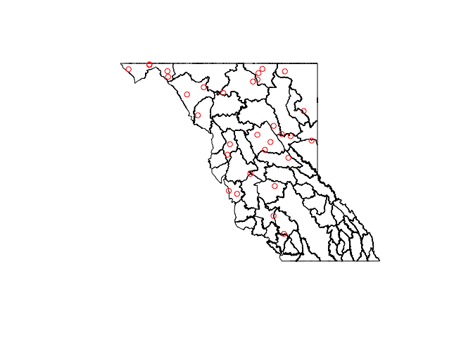

# Exploring Grizzly Data
  
June 5, 2015  

In this lesson, we are going to be using open data from [DataBC](http://data.gov.bc.ca) to learn about cleaning and tidying data, and merging tabular data with spatial data so we can visualize it.

We're going to use a number of packages in this lesson, so we will start with loading them all:


```r
library(dplyr)
library(sp)
library(rgdal)
library(ggplot2)
```

### Grizzly Bear Population Units spatial data

First, you will need to get the data. Unfortunately, we are unable to read/download this directly from DataBC. Visit the [metadata record](http://catalogue.data.gov.bc.ca/dataset/grizzly-bear-population-units/resource/7a7713f9-bcbd-46b8-968a-03d343d367fb) for the data at DataBC. Click on the **Go To Resource** button and submit the form with the following settings:


When you get the email with the link to the zip file, save it in your working directory as `data/DataBC_GBPU.zip`

Next we'll unzip the file, and import the shapefile. You will need the `sp` and `rgdal` packages: 

- The `sp` package provides classes (data structures) for spatial objects, including `SpatialPoints`, 
`SpatialPolygons`, `SpatialLines`, etc. Each of these classes has a complementary class that can hold attributes that go along with the spatial data. They are `SpatialPointsDataFrame`, `SpatialPolygonsDataFrame`, `SpatialLinesDataFrame`. You always need this package when working with spatial data.

- The `rgdal` package provides input/output and projection/transformation operations for spatial data via bindings to the Geospatial Data Abstraction Library (GDAL).


```r
zipfile <- "data/DataBC_GBPU.zip"

if (!file.exists(zipfile)) {
  download.file("https://github.com/ateucher/BCenviroLessons/raw/master/data_exploration/data/DataBC_GBPU.zip", destfile = zipfile)
}

unzip(zipfile, exdir = "data")

gbpu <- readOGR(dsn = "data/GBPU_BC", layer = "GBPU_BC_polygon", 
                encoding = "ESRI Shapefile", stringsAsFactors = FALSE)
```

```
## OGR data source with driver: ESRI Shapefile 
## Source: "data/GBPU_BC", layer: "GBPU_BC_polygon"
## with 278 features
## It has 9 fields
```

```
## Warning in readOGR(dsn = "data/GBPU_BC", layer = "GBPU_BC_polygon",
## encoding = "ESRI Shapefile", : Z-dimension discarded
```

Let's explore the gbpu spatial object. It is of class `SpatialPolygonsDataFrame`, which is a special class of **R** object for representing spatial data, implemented in the `sp` package.


```r
class(gbpu)
```

```
## [1] "SpatialPolygonsDataFrame"
## attr(,"package")
## [1] "sp"
```

```r
summary(gbpu)
```

```
## Object of class SpatialPolygonsDataFrame
## Coordinates:
##          min        max
## x -138.87460 -112.37761
## y   46.95695   60.00142
## Is projected: FALSE 
## proj4string :
## [+proj=longlat +datum=NAD83 +no_defs +ellps=GRS80 +towgs84=0,0,0]
## Data attributes:
##     GBPU_TAG       GBPU_YRMOD   GBPU_VERS          GBPU_NAME        
##  Min.   : 0.00   Min.   : NA   Length:278         Length:278        
##  1st Qu.:23.00   1st Qu.: NA   Class :character   Class :character  
##  Median :42.50   Median : NA   Mode  :character   Mode  :character  
##  Mean   :42.68   Mean   :NaN                                        
##  3rd Qu.:64.00   3rd Qu.: NA                                        
##  Max.   :85.00   Max.   : NA                                        
##                  NA's   :278                                        
##     OBJECTID         GBPU_ID        GBPU_DISP          GBPUSTATUS       
##  Min.   :  1.00   Min.   : 841.0   Length:278         Length:278        
##  1st Qu.: 70.25   1st Qu.: 910.2   Class :character   Class :character  
##  Median :139.50   Median : 979.5   Mode  :character   Mode  :character  
##  Mean   :139.50   Mean   : 979.5                                        
##  3rd Qu.:208.75   3rd Qu.:1048.8                                        
##  Max.   :278.00   Max.   :1118.0                                        
##                                                                         
##   GPBU_W_BC        
##  Length:278        
##  Class :character  
##  Mode  :character  
##                    
##                    
##                    
## 
```

`sp` objects are S4 objects - which are kind of like regular S3 lists, but are more formally defined. They also have a special type of field, called slots, that are accessed using the `@` operator. You use this in the same way you use the `$` to access list elements, or columns in a data frame.

We can see the slotNames in an `sp` object using the `slotNames()` funcion, and look at any of them using `@`:


```r
slotNames(gbpu)
```

```
## [1] "data"        "polygons"    "plotOrder"   "bbox"        "proj4string"
```

```r
head(gbpu@data)
```

```
##   GBPU_TAG GBPU_YRMOD GBPU_VERS    GBPU_NAME OBJECTID GBPU_ID    GBPU_DISP
## 0       84         NA      2005 Tatshenshini        1     841 Tatshenshini
## 1       73         NA      2005      Cassiar        2     842      Cassiar
## 2       51         NA      2005        Taiga        3     843        Taiga
## 3       52         NA      2005       Hyland        4     844       Hyland
## 4       55         NA      2005       Muskwa        5     845       Muskwa
## 5       54         NA      2005         Taku        6     846         Taku
##   GBPUSTATUS GPBU_W_BC
## 0     Viable         Y
## 1     Viable         Y
## 2     Viable         Y
## 3     Viable         Y
## 4     Viable         Y
## 5     Viable         Y
```

From the [metadata page](http://catalogue.data.gov.bc.ca/dataset/grizzly-bear-population-units/resource/7a7713f9-bcbd-46b8-968a-03d343d367fb), we know that there are several versions of the population units in this file. From the summary above it looks like the version is stored in the `GBPU_VERS`. Let's only use the latest version (2012). Note that we can use subsetting using `$` and `[` just like we do on normal data frames.

We can then plot the polygons to have a quick look.


```r
gbpu_2012 <- gbpu[gbpu$GBPU_VERS == 2012, ]
plot(gbpu_2012)
```

 

### Grizzly bear data: population estimates

DataBC has data on [population estimates](http://catalogue.data.gov.bc.ca/dataset/2012-grizzly-bear-population-estimates).


```r
population <- read.csv("http://www.env.gov.bc.ca/soe/archive/data/plants-and-animals/2012_Grizzly_Status/Grizzly_population_estimate_2012.csv", stringsAsFactors = FALSE)
```

Next let's tidy up the population data. The first, eighth, and ninth columns (`X.`) doesn't contain any useful information, so we can get rid if it. Also, we see that there is some metadata in the first five rows of the `Notes.` column. We should remove it too:


```r
population <- select(population, -contains("X"), -Notes.)
```

The population estimates are split up by Population Unit (`GBPU`) and Management Unit (`MU`). Let's summarise by Population Unit. `dplyr` has some great functions for this sort of summary analysis.


```r
## First we set the grouping variable to be GBPU
population_gbpu <- group_by(population, GBPU)

## Then we can summarize based on those groups. We will need to recalculate 
## the density.
population_gbpu <- summarise(population_gbpu, 
                             Estimate = sum(Estimate, na.rm = TRUE), 
                             Total_Area = sum(Total_Area, na.rm = TRUE), 
                             Density = Estimate / Total_Area * 1000)
head(population_gbpu)
```

```
## Source: local data frame [6 x 4]
## 
##                        GBPU Estimate Total_Area   Density
## 1                      Alta      132      13239  9.970542
## 2                    Babine      313      13805 22.672945
## 3 Blackwater-West Chilcotin       53      20416  2.596003
## 4             Bulkley-Lakes      439      22554 19.464397
## 5                   Cassiar      612      35803 17.093540
## 6          Central Monashee      147       6155 23.883022
```

Now that we have a map of GBPUs, and a data frame with a single population estimate per GBPU, we can merge the population estimates into the SpatialPolygonsDataFrame.


```r
## First we should make sure that the GBPU names in the two objects are the same
setdiff(na.omit(gbpu_2012$GBPU_NAME), population_gbpu$GBPU)
```

```
## [1] "North Purcells"         "Central-South Purcells"
```

```r
setdiff(population_gbpu$GBPU, na.omit(gbpu_2012$GBPU_NAME))
```

```
## [1] "Central Purcells" "North Purcell"
```

```r
population_gbpu$GBPU[population_gbpu$GBPU == "Central Purcells"] <- "Central-South Purcells"
population_gbpu$GBPU[population_gbpu$GBPU == "North Purcell"] <- "North Purcells"

## Check to make sure they are equal now
all.equal(sort(population_gbpu$GBPU), sort(na.omit(gbpu_2012$GBPU_NAME)))
```

```
## [1] TRUE
```

Now lets plot the map using ggplot2, and fill the polygons based on population density. First we need to use the function `fortify` from `ggplot2`, to turn the SpatialPolygonsDataFrame into a data frame, then merge the attributes from `population_gbpu`:


```r
gbpu_df <- fortify(gbpu_2012, region = "GBPU_NAME")
gbpu_df <- merge(gbpu_df, population_gbpu, by.x = "id", by.y = "GBPU")

ggplot(gbpu_df, aes(x = long, y = lat, group = group)) + 
  geom_polygon(aes(fill = Density)) + 
  geom_path(colour = "white") + 
  coord_map() + 
  theme_minimal()
```

 

### Getting polygon attributes into point data

Let's create a random assortment of points we collected in BC:


```r
pts <- data.frame(id = 1:100, 
                  x = runif(100, gbpu@bbox["x", "min"], gbpu@bbox["x", "max"]), 
                  y = runif(100, gbpu@bbox["y", "min"], gbpu@bbox["y", "max"]))
head(pts)
```

```
##   id         x        y
## 1  1 -113.7590 55.64113
## 2  2 -126.8170 47.23253
## 3  3 -122.5627 55.95295
## 4  4 -114.2592 55.01244
## 5  5 -128.6258 54.91876
## 6  6 -122.7050 48.20504
```

To convert a data frame of lats and longs to a SpatialPointsDataFrame, use the `coordinates()` function from the `sp` package


```r
coordinates(pts) <- ~x+y
proj4string(pts)
```

```
## [1] NA
```

We know that the points were collected in the same coordinate system as the gbpu data (lat/long, unprojected)


```r
proj4string(pts) <- proj4string(gbpu_2012)
plot(gbpu_2012)
points(pts)
```

 

Use the `over` function to overlay features from different layers

```r
pt_attributes <- over(pts, gbpu_2012)
pts$GBPU_NAME <- pt_attributes$GBPU_NAME
head(pts@data)
```

```
##   id GBPU_NAME
## 1  1      <NA>
## 2  2      <NA>
## 3  3   Moberly
## 4  4      <NA>
## 5  5 Cranberry
## 6  6      <NA>
```

Now we can also use the `over` results to get rid of the obviously wrong points


```r
pts_valid <- pts[!is.na(pts$GBPU_NAME), ]
plot(gbpu_2012)
points(pts_valid, col = "red")
```

 

